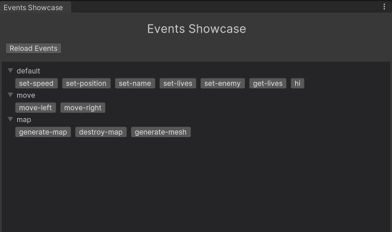

# Unity Events Showcase

UES is a editor extension allowing you run any object method from editor window with just a few clicks.

<p style="margin-top: 60px"></p>

<div style="display: flex; justify-content: center; align-items: center; flex-direction: column">
    </img>
    <div style="margin-top: 4px; font-style: italic; font-size: 14px; color: grey;">UES Window</div>
</div>

<p style="margin-top: 40px"></p>

## Features

✅ Works both in editor and play modes

✅ Accesses object's methods with select object menu

✅ Run static methods

✅ Update with a single button

## Install

<div class="notecard note">
    <h4>1. Git URL</h4>
    <p>Get most recent package version from git</p>
    <p>Window -> Package Manager -> Add from git URL</p>
    <pre class="brush: js">git@github.com:IlyaChichkov/Events-Showcase.git</pre>
    <h4>2. Download package file</h4>
    <p>Download release archive from github</p>
    <p>Window -> Package Manager -> Add from disk</p>
</div>

## How to use

1. Import package

```cs
using UES;
```

2. Add attribute to your class method:

```cs
// ConsoleCommand('name', 'group', 'description')
[ConsoleCommand("move-left", "move", "")]
public void MoveLeft()
{
    // Some movement code...
}
```

### Bugs

This is very raw project with many bugs and shortcomings and I do my best to make it better and stable, I will be pleased for any feedback. Please take it to you considerations. Author doesn't responsible for any crashes in you project.

### Unity tested version

2021.3 4f1

## Author

Github - [@IlyaChichkov](https://github.com/IlyaChichkov/)

Email - [ilya.chichkov.dev@gmail.com](mailto:ilya.chichkov.dev@gmail.com)
